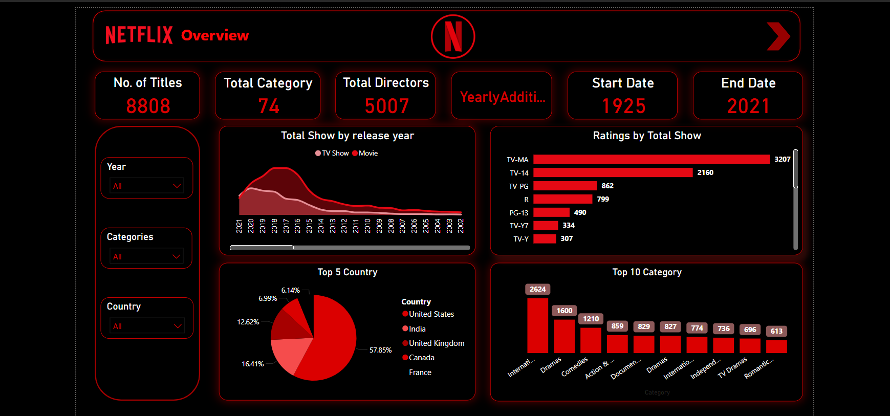

# Netfilx-Films-TV-Shows

# Description

This dashboard analyzes Netflix's catalog, showcasing trends in titles over the years, top-rated categories, and country-wise distribution of movies and TV shows. It highlights key metrics like total titles, categories, and director counts, providing a clear overview of Netflix's content from 1925 to 2021

# Tools:
- Power Query power query data cleaning
- DAX : For data preparation, calculations, and measures.
- Power BI: For interactive dashboards and data visualization.

# Netflix Overview Dashboard
The Netflix Overview Dashboard offers a comprehensive summary of the platform's content library, focusing on key metrics such as total titles, categories, and directors. It highlights trends in content release over the years, providing a clear comparison of TV shows and movies across various dimensions like ratings, categories, and countries.

# Key Features

- Total Titles: 8,808
- Total Categories: 74
- Total Directors: 5,007
- Content Coverage: From 1925 to 2021

# Visualizations:

# Total Show by Release Year (Area Chart):
Highlights the release trends of TV shows and movies over the years, with a peak around 2017.

# Ratings by Total Show (Bar Chart):
Breaks down titles by ratings, showing the highest count for TV-MA (3,207).

# Top 5 Countries (Pie Chart):
Represents the distribution of titles, with the USA leading (57.85%), followed by India and the UK.

# Top 10 Categories (Bar Chart):
Displays the most frequent categories, with "International Movies" leading (2,624).

# Filters (Slicers):
Interactive filters for "Year," "Categories," and "Country" allow users to explore specific data segments.

