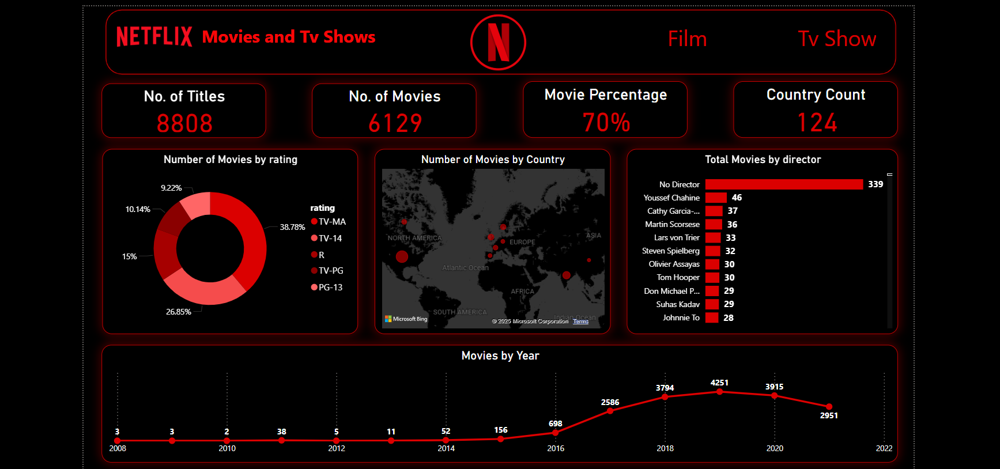
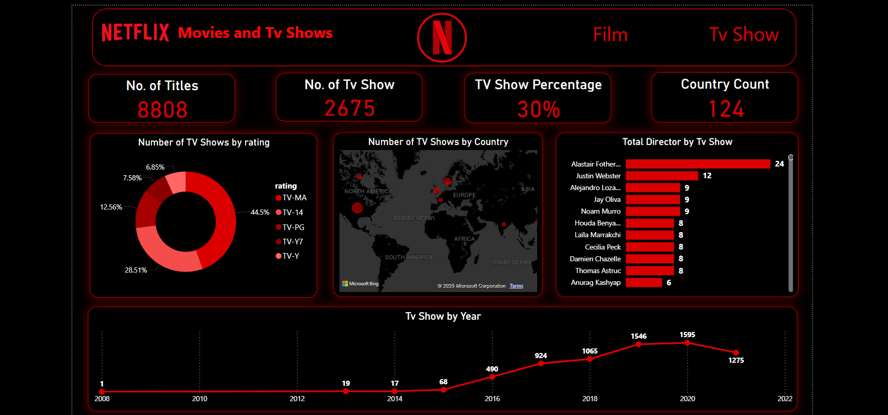

# Netfilx-Films-TV-Shows

# Description

This dashboard analyzes Netflix's catalog, showcasing trends in titles over the years, top-rated categories, and country-wise distribution of movies and TV shows. It highlights key metrics like total titles, categories, and director counts, providing a clear overview of Netflix's content from 1925 to 2021

# Tools:
- Power Query power query data cleaning
- DAX : For data preparation, calculations, and measures.
- Power BI: For interactive dashboards and data visualization.

# Netflix Overview Dashboard
The Netflix Overview Dashboard offers a comprehensive summary of the platform's content library, focusing on key metrics such as total titles, categories, and directors. It highlights trends in content release over the years, providing a clear comparison of TV shows and movies across various dimensions like ratings, categories, and countries.

# Key Features

- Total Titles: 8,808
- Total Categories: 74
- Total Directors: 5,007
- Content Coverage: From 1925 to 2021

# Visualizations:

# Total Show by Release Year (Area Chart):
Highlights the release trends of TV shows and movies over the years, with a peak around 2017.

# Ratings by Total Show (Bar Chart):
Breaks down titles by ratings, showing the highest count for TV-MA (3,207).

# Top 5 Countries (Pie Chart):
Represents the distribution of titles, with the USA leading (57.85%), followed by India and the UK.

# Top 10 Categories (Bar Chart):
Displays the most frequent categories, with "International Movies" leading (2,624).

# Filters (Slicers):
Interactive filters for "Year," "Categories," and "Country" allow users to explore specific data segments.

# Netflix Movies Dashboard

The Netflix Movies and TV Shows Dashboard offers detailed insights into the platform's content, focusing on the distribution of movies and TV shows by rating, region, and directors. It emphasizes trends in movie releases and their geographical distribution.

# Key Features
- Total Titles: 8,808
- Total Movies: 6,129 (70% of total titles)
- Country Count: 124

# Visualizations:

# Number of Movies by Rating (Donut Chart):

Visualizes the proportion of movies by ratings, with TV-MA (38.78%) being the largest category.

# Number of Movies by Country (Map):

Highlights key cities like Los Angeles, San Francisco, and Dallas as major contributors to sales.

# Total Movies by Director (Bar Chart):

Displays top directors with the most movies, led by "No Director" (339), followed by Youssef Chahine (46) and Cathy Garcia (37).

# Movies by Year (Line Chart):

Shows trends in movie releases over the years, peaking in 2018 with 4,251 movies.

# Interactive Filters (Slicers):

Interactive options for exploring data by "Film" and "TV Show", enabling deeper analysis.

# Netflix TV Shows Dashboard
The Netflix TV Shows Dashboard offers a detailed exploration of the platform's TV shows, highlighting trends, ratings, and key contributors. It focuses on analyzing TV show distribution across various regions, categories, and release years.

# Key Features
- Total TV Shows: 2,679
- Coverage: From 1925 to 2021
- Top Contributors: Countries and categories with the most TV shows

# Visualizations:

# Total TV Shows by Release Year (Line Chart):

Tracks the release trends of TV shows over the years, peaking around 2017.

# Ratings by TV Shows (Bar Chart):

Visualizes the distribution of TV shows by ratings, with TV-MA leading at 1,000+ titles.

# Top 5 Countries (Pie Chart):

Highlights the countries contributing most to TV shows, led by the USA, India, and UK.

# Top Categories for TV Shows (Bar Chart):

Displays the most frequent categories, with genres like Dramas and International TV Shows dominating.

# Interactive Filters (Slicers):

Offers dynamic filters for Year, Country, and Categories, enabling tailored insights.

# Conclusion

This project delivers comprehensive insights into Netflix's content library, including trends in TV shows and movies, ratings distribution, and geographical contributions.

The interactive dashboards enable users to explore data dynamically, identify key patterns, and make informed decisions regarding content strategy and audience engagement.

